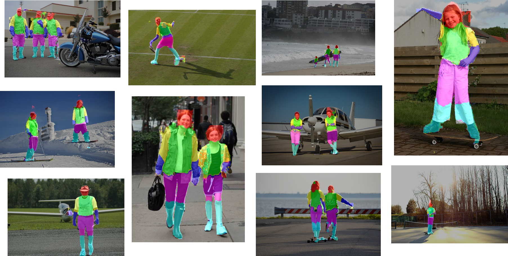
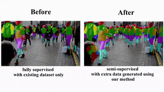

# Weakly and Semi Supervised Human Body Part Parsing via Pose-Guided Knowledge Transfer 

[[arXiv](https://arxiv.org/abs/1805.04310)]

Transferring human body part parsing labels to raw images by exploiting the anatomical similarity. Some transferred results:

<p align="center">
    
</p>

These results are used as extra training samples for the parsing network and can improve the part segmentation results:


<p align="center">
    
</p>

## Getting Started

#### Demo video

Check out our demo video [here](https://youtu.be/nDqnMpE6b8s).

#### Parsing Network

Checkout `parsing_network` for training\testing\demo code of our parsing network.

#### Data generation

Checkout `data_generation` for code of using keypoints similarity to transfer parsing knowledge and generate synthetic training labels.

## Feedback

If you get any problems during usage, please open an issue.

## Citation
If you use this code for your research, please cite our paper:

```
@article{fang2018wshp,
  title={Weakly and Semi Supervised Human Body Part Parsing via Pose-Guided Knowledge Transfer},
  author={Fang, Hao-Shu and Lu, Guansong and Fang, Xiaolin and Xie, Jianwen and Tai, Yu-Wing and Lu, Cewu},
  journal={CVPR},
  year={2018}
}
```
