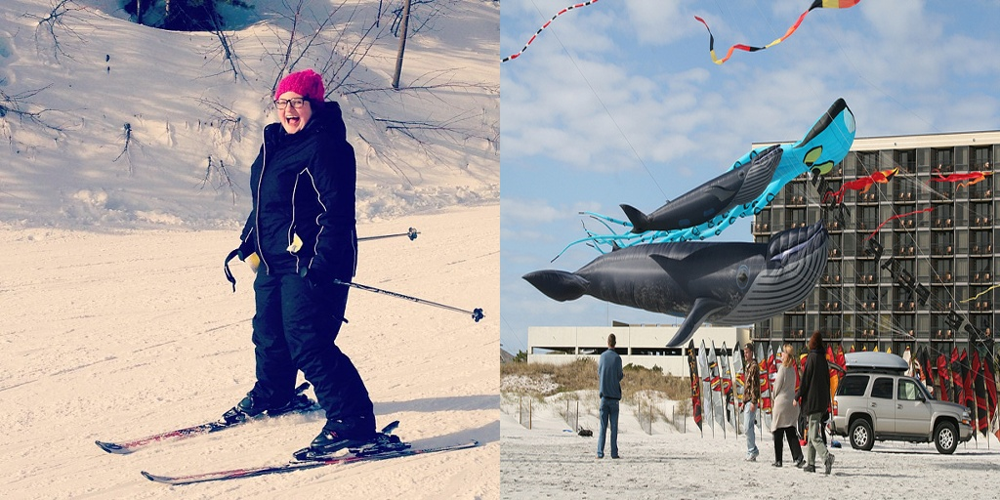
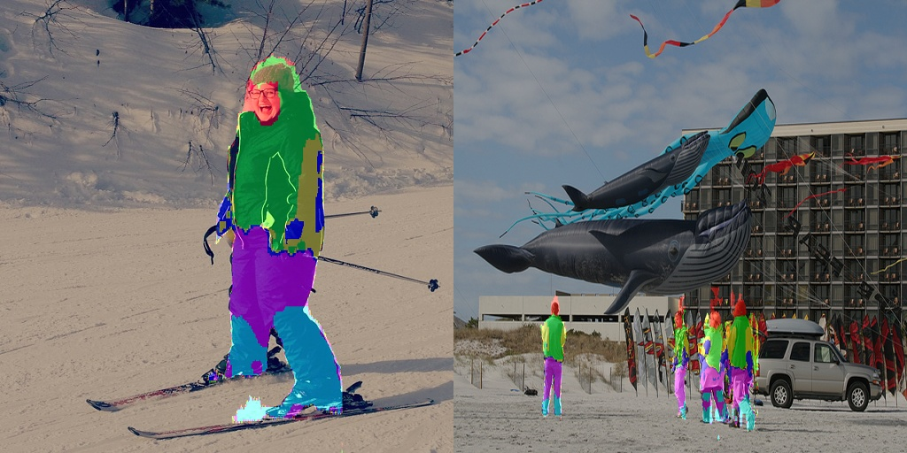

# Generate Parsing Label
This is the code of generating parsing label for the semi-supervised training of the Parsing Network.

## Prerequisites
- Linux or macOS
- Python 2 and 3

## Getting Started
### Installation
- Install python libraries if missing, include opencv-python, numpy, etc.

- Install PyTorch 0.3.0 and dependencies from http://pytorch.org in Python 3.
- Install Torch vision from the source in Python 3.
```bash
git clone https://github.com/pytorch/vision
cd vision
python3 setup.py install
```

- Install python libraries [visdom](https://github.com/facebookresearch/visdom) and [dominate](https://github.com/Knio/dominate) in Python3.
```bash
pip3 install visdom
pip3 install dominate
```

- Clone this repo:
```bash
git clone https://github.com/MVIG-SJTU/WSHP
cd WSHP/data_generation
```
- Download [demo data](https://drive.google.com/open?id=1N6yYgrulPHqsCRACdbX7MpAWFnYNaAYm) and extract them to directory `examples`.

### Demo
- For demo, just run the following bash order:
```
bash demo.sh
```

- After finished, under directory `examples/outputs`, directories `crop_output`, `merge_output`, `overlay_output` contains outputs for `cropped origin image and prior of single person`, `complete parsing label of complete origin image`, `overlayed origin image and parsing label` respectively.

Origin images:
<p align="center">
    
</p>

Parsing labels:
<p align="center">
    
</p>

### Run
1. Prepare keypoint annotations. For dataset without keypoint annotations, one can use keypoint detecion network to detect keypoint. We use [AlphaPose](https://github.com/MVIG-SJTU/AlphaPose) by running `./run.sh --indir examples/demo/ --outdir examples/results/ --dataset MPII`. **Note that our algorithm can only apply to images with whole body persons, use `pick_full_person.py` to select such images**. Under the folder `examples`, file `examples.json` is an example output and our code reads keypoint information from a json file with the same format.

2. Crop and generate prior. Python script `crop_pose_and_generate_testing_prior.py` shows how to crop out single person from origin images and generate prior given keypoint information (specified by a json file).
```
python crop_pose_and_generate_testing_prior.py --PASCALPoseFileRoot /path/to/pascal_pose_file.csv --PASCALMaskImgDir /path/to/pascal_mask_img --n 3 --k 3 --aug 0.25 --origin_img_root /path/to/origin_img --json_file_root /path/to/pose_json_file --outputDir /path/to/output
```

3. Generate parsing label for single person. In this step we can use the test mode of a pretrained model of refinement network to generate label for each image of single person. This part please refer to submodule `refinement_network`.

4. Merge together to get the complete parsing label. Python script `merge_parsing_result.py` shows how to merge together label of different person from the same image to get the complete parsing label for each origin image.
```
python merge_parsing_result.py --outputDir /path/to/output --parsing_root /root_of_refinement_network/results/${experiment_name}/test_latest/images --origin_img_root /path/to/origin_img --json_file_root /path/to/pose_json_file --aug 0.25
```

5. Overlay origin image with corresponding color parsing label to check the results.
```
python overlay.py --origin_img_root /path/to/origin_img --prior_img_root /path/to/origin_img --outputDir /path/to/output
```

- Bash script `pose2label.sh` gather steps 2,3,4,5 together, you can use it to get parsing label conveniently without waiting for each step to finish and start the next step.
```
bash pose2label.sh
```
You have to specify the following parameters at the begining of the script:
```
pascal_pose_file_root="/path/to/pascal_pose_file.csv"
pascal_mask_img_dir="/path/to/pascal_mask_img"
origin_img_root="/path/to/origin_img"
json_file_root="/path/to/pose_json_file"
crop_output_path="/path/to/output/cropped_img_and_prior"
experiment_name="exp1"
merge_output_path="/path/to/output/merged_parsing_label"
overlay_output_path="/path/to/output/overlayed_image"
```

- One thing should be noted is the format of keypoints.
The order we use for Pascal images is as follow:
```
0-'right ankle'  1-'right knee'  2-'right hip'  3-'left hip'  4-'left knee'  5-'left ankle'  6-'pelvis'  7-'thorax'  8-'neck'  9-'head'  10-'right wrist'  11-'right elbow'  12-'right shoulder'  13-'left shoulder'  14-'left elbow'  15-'left wrist'.
```
Actually, `thorax` is unused and set to `(0, 0)`. And when `pelvis` is missing, we use the midpoint of two hips instead.
The format of the output of [AlphaPose](https://github.com/MVIG-SJTU/AlphaPose) is different from this format and we adjust it in our code so that it can be compared with pose of Pascal images.

