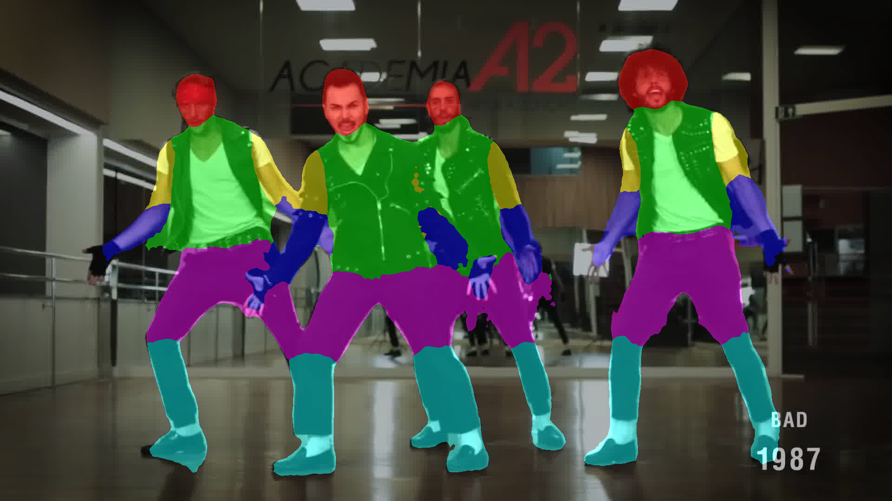

# Parsing Network

## Requirements

TensorFlow (version >= 1.1.0) needs to be installed before running the scripts.
To install the required python packages (except TensorFlow), run
```bash
pip install -r requirements.txt
```
or for a local installation
```bash
pip install -user -r requirements.txt
```

## Preparation

To train the network, you first need to download the data from [here](https://jbox.sjtu.edu.cn/l/H1Nwz8). It contains data from original Pascal-Person-Part dataset and our generated data. Our released dataset contains over 150K images, which we believe can facilitate the research in the area of human parsing. After downloading the dataset, unzip it to folder `dataset/`. Besides, download the pre-trained weights on COCO dataset from [here](https://jbox.sjtu.edu.cn/l/hJjgjw) or [here](http://mvig.sjtu.edu.cn/publications/wshp/models.zip) and unzip it under current folder.

## Training

Our training method consists of two steps. First, we train our network on the whole dataset. Then we finetune the model on the original dataset. Note that due to time limitation, we only train the network on the whole dataset for 10 epochs. There may be potential performance gains if we train for more epochs.
```bash
## Train our network on the whole dataset, model.ckpt-50000 is the pre-trained weights on COCO dataset
python train.py --data-dir ./dataset/ --data-list dataset/train_all.txt --num-epochs 10 --restore-from models/model.ckpt-50000 --not-restore-last --snapshot-dir snapshots-new-fromcoco --random-scale --random-mirror --save-pred-every 50000

## Finetune the model on the original dataset
python train.py --data-dir ./dataset/ --data-list dataset/pascal_train.txt --num-epochs 90 --restore-from snapshots-new-fromcoco/model.ckpt-213129 --snapshot-dir snapshots-new-fromcoco-finetune --random-scale --random-mirror --save-pred-every 10000
```

It takes about two days to train a model on a single Titan X GPU card.


## Evaluation
We provide a pretrained model in `models/final_model/`.
Run the following command to get the evaluation result of Pascal-Person-Part dataset, it should achieve <code>64.3%</code> of mean intersection-over-union:
```bash
python evaluate.py --data-dir ./dataset/ --restore-from ./models/final_model/model.ckpt-19315
```

## Inference

To perform inference over your own images, use the following command:
```bash
python inference.py /path/to/img/folder /path/to/model --data_list /path/to/data/list
```
This will run the forward pass and save the renderred result at `\output` folder:

<p align="center">
    
</p>

## Acknowledgement

This implementation of [DeepLabV2-ResNet](http://liangchiehchen.com/projects/DeepLabv2_resnet.html) is originally from [tensorflow-deeplab-resnet](https://github.com/DrSleep/tensorflow-deeplab-resnet). Thanks DrSleep for his sharing!
